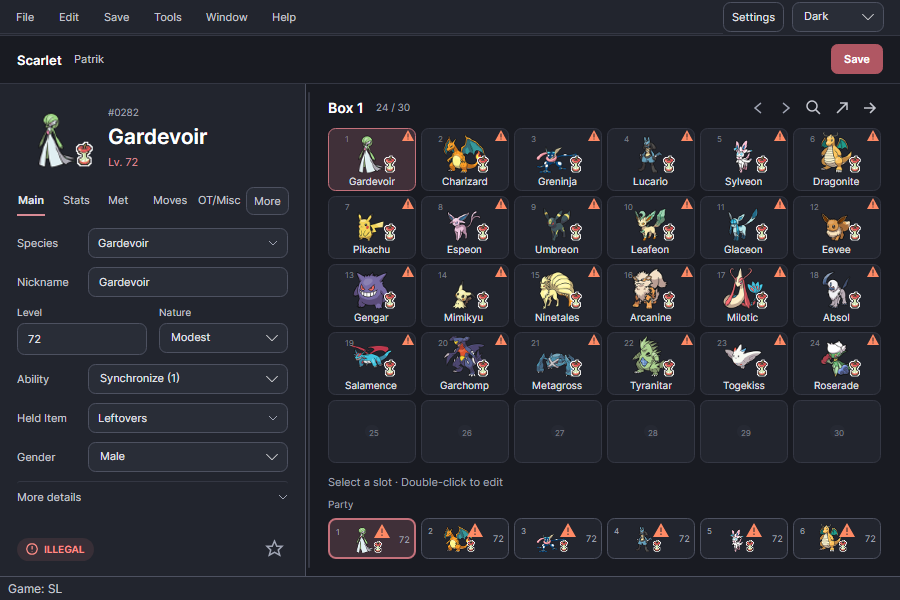
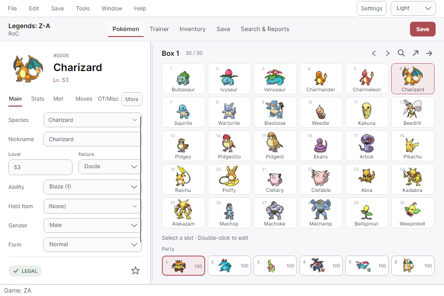
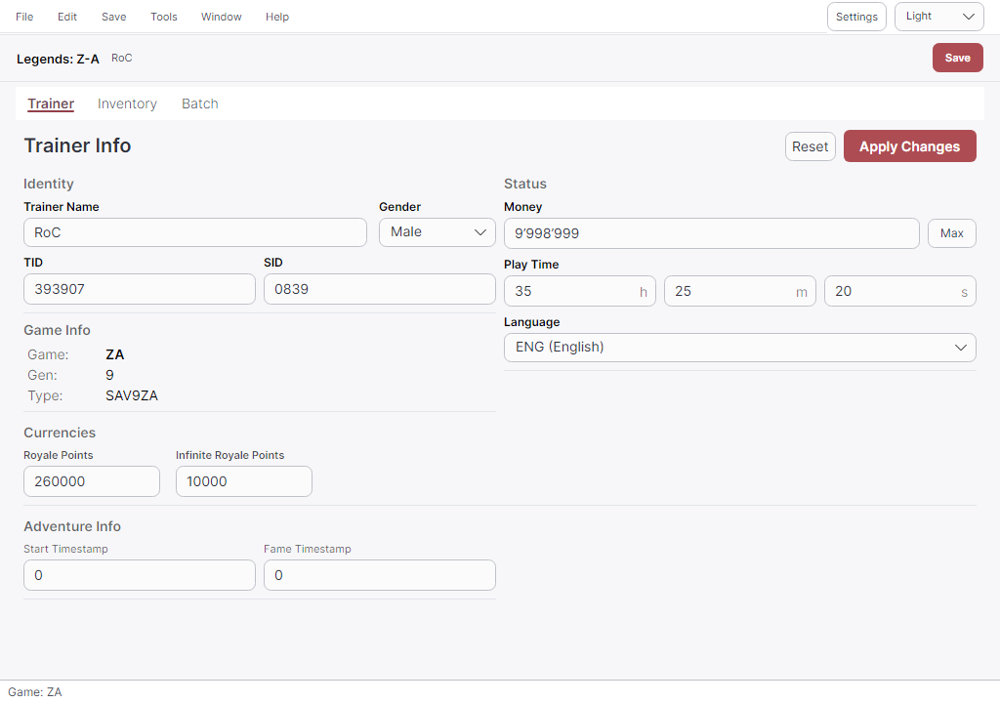
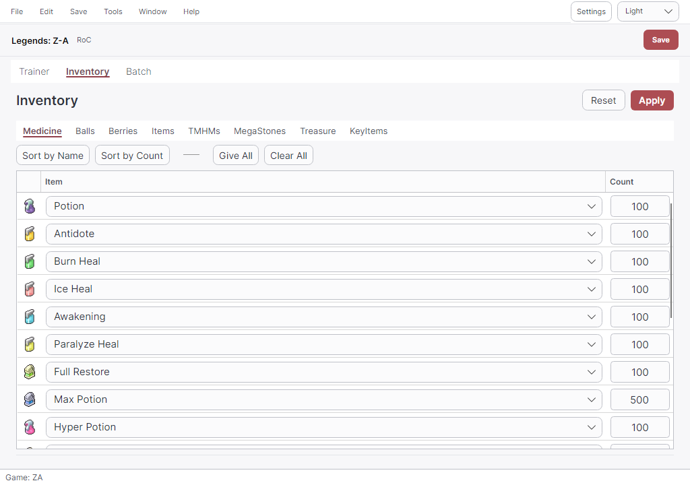
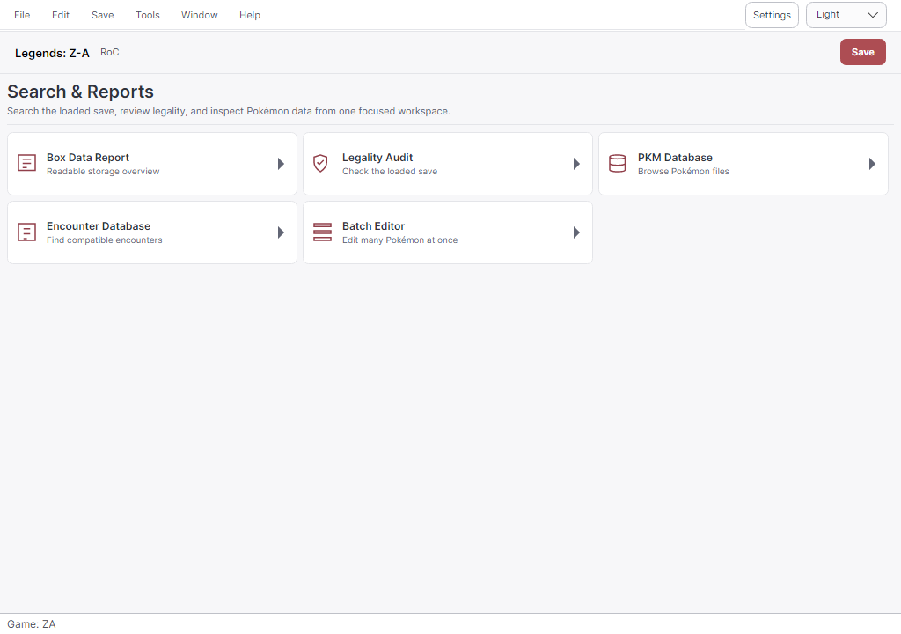
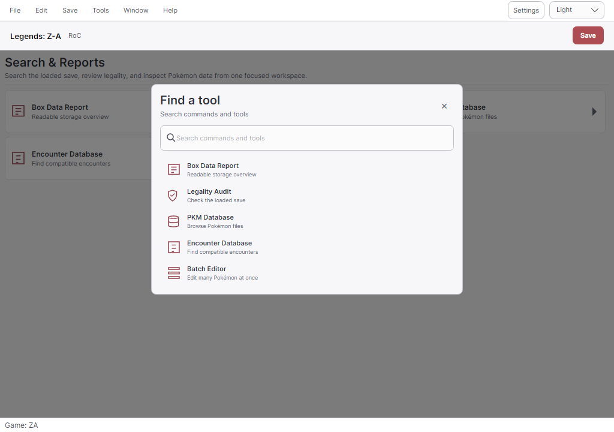
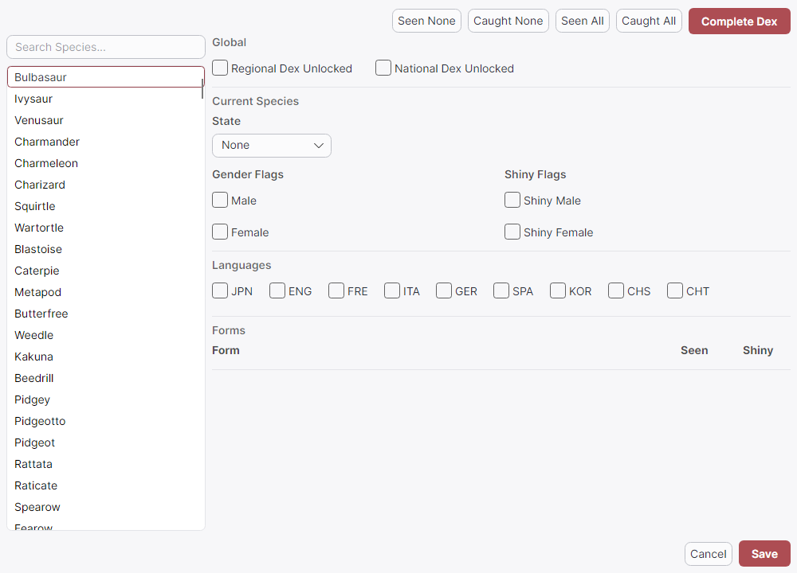
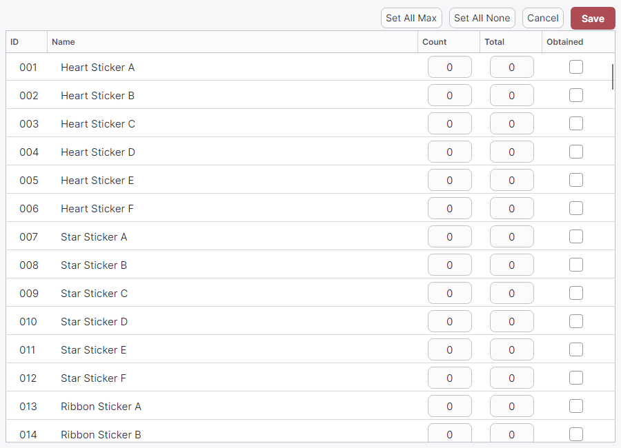
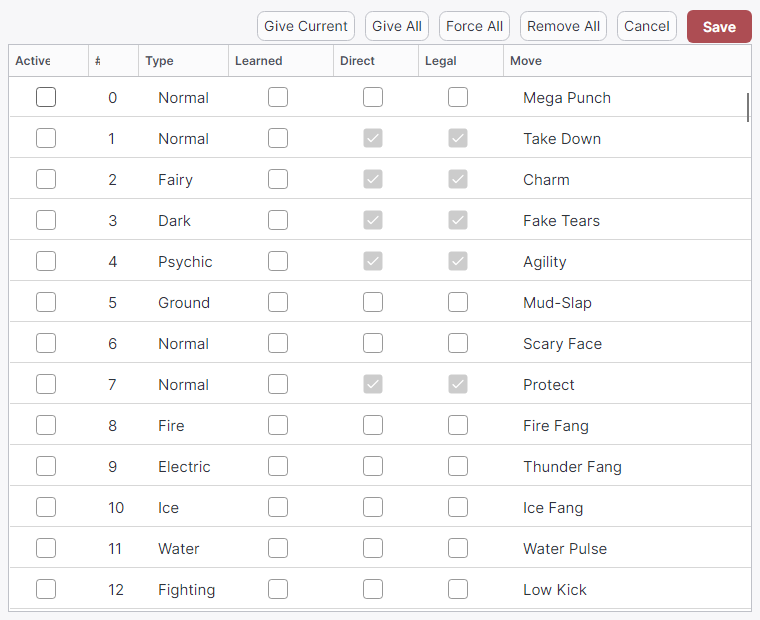

# PKHeX-Avalonia

[](https://github.com/realgarit/PKHeX-Avalonia/releases/latest)
[](https://github.com/realgarit/PKHeX-Avalonia/actions/workflows/ci.yml)
[](LICENSE)
[](https://github.com/realgarit/PKHeX-Avalonia/releases)
[](https://discord.gg/DY2SWKsV75)

A native Pokémon save editor for **Windows, macOS, and Linux**, built with .NET 10 and Avalonia 11 on the upstream [PKHeX](https://github.com/kwsch/PKHeX) engine.

[Download](#download) · [Getting started](#getting-started) · [Features](#features) · [Screenshots](#screenshots) · [Build](#building-from-source) · [Community](#community)

<p align="center">
  <a href="docs/screenshots/pokemon-editor-dark.png"></a>
</p>

The default 900×600 workspace keeps Pokémon editing, box navigation, and the party together. Advanced fields and game-specific tools are available through **More**, **Tools**, and the searchable tool launcher.

## Download

Get a self-contained package from the [official latest release](https://github.com/realgarit/PKHeX-Avalonia/releases/latest). **No .NET installation is required to run it.**

| Platform | Portable package | Installer or app image |
|---|---|---|
| Windows x64 | `PKHeX-Avalonia-win-x64.zip` | `PKHeX-Avalonia-Setup-unsigned.exe` |
| Linux x64 | `PKHeX-Avalonia-linux-x64.zip` | `PKHeX-Avalonia-linux-x64.AppImage` |
| macOS Apple Silicon | `PKHeX-Avalonia-osx-arm64.zip` | `PKHeX-Avalonia-osx-arm64-selfsigned.dmg` |
| macOS Intel | `PKHeX-Avalonia-osx-x64.zip` | `PKHeX-Avalonia-osx-x64-selfsigned.dmg` |

These filenames match v1.49.12. Signing suffixes may change; always check the release's asset list.

- **Windows:** extract the complete ZIP before launching, or use the installer.
- **macOS:** open the DMG and copy the app to Applications, or extract the ZIP. A self-signed build is not Apple-notarized and may require first-launch approval.
- **Linux:** extract the ZIP, or make the AppImage executable with `chmod +x PKHeX-Avalonia-linux-x64.AppImage` and launch it.

See the [packaging guide](docs/packaging.md) for signing details and platform troubleshooting. The Homebrew and winget files under `packaging/` are distribution templates; they do not establish that a public package-manager listing is available.

The app checks GitHub Releases for updates and can display release notes. A manual **Check for Updates** action is available in **Help → About**.

## Getting started

1. Keep an untouched backup of your exported game save.
2. Use **File → Open**, or drop the save onto the window.
3. Select a box slot and double-click it to load its Pokémon into the editor.
4. Edit Main, Stats, Met, Moves, or OT/Misc fields. Use **More** for additional sections, then the slot's **Set** action to place the edited Pokémon back into a slot.
5. Use **File → Save As** for a separate copy, or **Save** to update the loaded file.

Pokémon-file import requires a compatible save to be open. Available fields and tools depend on the save and Pokémon format. Legality results describe the checks supported by the current engine; they do not guarantee acceptance by online services.

## Features

### Pokémon and save editing

- Save support across Generations 1–9, including Let's Go, Legends: Arceus, BDSP, and Legends: Z-A, as supported by the bundled Core engine.
- Edit species, forms, abilities, held items, stats, IVs/EVs, moves, met data, trainer identities, ribbons, and memories where the format supports them.
- Live legality reports, derived characteristics alongside stats, numeric Met Location tooltips, and generation-aware trainer IDs.
- Box and party navigation, slot moves/copies, file drag-and-drop, and detached Box/Party windows. Undo/redo covers supported slot operations.
- Pokémon-file and Showdown import/export, with format conversion where Core supports it.
- Trainer, inventory, Pokédex, batch, Hall of Fame, Secret Base, and other game-specific editors.
- Received Switch Mystery Gift records for Sword/Shield, BDSP, Legends: Arceus, and Scarlet/Violet. This edits save-side gift history; it does not deliver or redeem BCAT gifts.
- Optional **PKHaX** mode for editing beyond normal constraints. Enable it in **Settings → Editor Behavior**, then restart.

### Tools for larger workflows

- **PKM, Mystery Gift, and Encounter databases:** search and inspect Pokémon and encounter data.
- **Legality Audit and Box Report:** review occupied slots across a save.
- **Batch Editor:** apply instructions to multiple Pokémon.
- **Auto-Legality Mod:** generate Pokémon from Showdown sets using the bundled legalization engine. Results depend on supported encounters and constraints; generation can fail.
- **Living Dex generator:** generate entries into available box space, with progress and cancellation.
- **Backup Manager and save diff:** manage automatic backups, restore saves, and compare slot contents.
- **LiveHeX:** read and write supported running Switch games over the local network using [sys-botbase](https://github.com/olliz0r/sys-botbase). Requires a compatible console setup and game version; see the [support matrix](PKHeX.Infrastructure/LiveHex/NOTICE.LiveHeX.md).

Use **Tools**, or **Ctrl+K** to search the tool launcher. The tool catalog reflects the loaded save's capabilities. See the [feature guide](docs/features.md) for details.

### Desktop experience

- Light and Dark themes, switchable at runtime from the top bar or Settings.
- Nine interface languages: English, German, Spanish, French, Italian, Japanese, Korean, Simplified Chinese, and Traditional Chinese. Switch through **Help → Language**.
- Compact and comfortable density settings, a resizable shell, and Pokémon, Save, and Reports workspaces.
- Keyboard navigation, contextual accessible control names, and visible focus. See [accessibility and shortcuts](docs/accessibility.md).
- Platform-specific settings/data directories, update notifications, and release notes.

## Screenshots

Expand any section to browse the app, then click its heading again to collapse it. Click an image for the full-size capture.

<details>
<summary><strong>Pokémon editor — dark and light themes</strong></summary>

The compact editor keeps Pokémon fields, box navigation, and the party together.




</details>

<details>
<summary><strong>Save editing — Trainer and Inventory</strong></summary>

Trainer identity, currencies, and play time, followed by the inventory's item pouches and quantities.




</details>

<details>
<summary><strong>Search &amp; Reports and the tool launcher</strong></summary>

Access save reports and databases, or find an available tool with Ctrl+K.




</details>

<details>
<summary><strong>BDSP editors — Pokédex and Seal Stickers</strong></summary>

Pokédex species, language, and form flags; sticker names, counts, totals, and obtained state.




</details>

<details>
<summary><strong>Technical Records</strong></summary>

Inspect record flags, current moves, and permission indicators, with staged bulk actions and Save/Cancel.



</details>

These are headless renders of the real Avalonia views, using synthetic Pokémon and checked-in test saves. The populated Pokémon editor's legality warnings are intentional. No private save data was used.

The [screenshot guide](docs/screenshots/README.md) explains how to regenerate the images without opening a desktop window.

## Building from source

Install the [.NET 10 SDK](https://dotnet.microsoft.com/download/dotnet/10.0) and Git:

```bash
git clone https://github.com/realgarit/PKHeX-Avalonia.git
cd PKHeX-Avalonia
dotnet restore PKHeX.sln
dotnet build PKHeX.sln -c Release
dotnet run --project PKHeX.Avalonia/PKHeX.Avalonia.csproj -c Release --no-build
```

Run tests after building:

```bash
dotnet test PKHeX.sln -c Release --no-build
```

Publish a self-contained build, for example Windows x64:

```bash
dotnet publish PKHeX.Avalonia/PKHeX.Avalonia.csproj -c Release -r win-x64 --self-contained true -o artifacts/win-x64
```

Other release targets are `linux-x64`, `osx-arm64`, and `osx-x64`. Installers, DMGs, and AppImages require the additional steps in the [packaging guide](docs/packaging.md).

## Project structure and contributing

| Project | Responsibility | Project dependencies |
|---|---|---|
| `PKHeX.Core` | Upstream save, Pokémon, encounter, and legality logic; mirrored byte-for-byte | None |
| `PKHeX.Application` | Framework-independent use cases and interfaces | Core |
| `PKHeX.Infrastructure` | Files, settings, backups, updates, legalization, LiveHeX | Application, Core, AutoMod |
| `PKHeX.Presentation` | ViewModels and localization; no Avalonia dependency | Application, Core |
| `PKHeX.Avalonia` | Desktop host, composition root, views, controls, themes | Core, Application, Infrastructure, Presentation |
| `PKHeX.AutoMod` | Vendored Auto-Legality Mod engine | Core |

Tests cover Core behavior, Avalonia controls/ViewModels, headless rendering, and architecture boundaries. CI builds and tests on Windows, macOS, and Linux.

Development is AI-assisted. Shared repository instructions are in [AGENTS.md](AGENTS.md). Contributions go through branches and pull requests. Keep consumer changes outside the Core mirror, add user-facing strings to all nine language resources, and include relevant regression coverage. CI owns the application version bump; do not edit `UIVersion` in a PR.

Start with [CONTRIBUTING.md](CONTRIBUTING.md) and the [development guide](docs/development.md).

## Community

Join the [PKHeX-Avalonia Discord](https://discord.gg/DY2SWKsV75) for support, testing, and feedback, or [open a GitHub issue](https://github.com/realgarit/PKHeX-Avalonia/issues).

Include the app version, operating system, game/save format, reproduction steps, and expected versus actual behavior in bug reports. Screenshots help explain UI problems. Avoid posting private save files or trainer information publicly.

## Documentation

- [Feature guide](docs/features.md): editing workflows, Auto-Legality Mod, Living Dex, LiveHeX, backups, and updates.
- [Development guide](docs/development.md): architecture, builds, tests, upstream synchronization, and releases.
- [Accessibility](docs/accessibility.md): keyboard shortcuts and screen-reader notes.
- [Packaging](docs/packaging.md): platform artifacts, installers, and signing.
- [Screenshot generation](docs/screenshots/README.md): reproducible headless captures.
- [Documentation index](docs/README.md): all project guides.

## Credits and license

Built on the work of the [PKHeX team](https://github.com/kwsch/PKHeX) and its research contributors.

- **Save and legality engine:** [PKHeX](https://github.com/kwsch/PKHeX).
- **Auto-Legality Mod:** [PKHeX-Plugins](https://github.com/santacrab2/PKHeX-Plugins), by architdate, santacrab2, and contributors. See the [vendoring notice](PKHeX.AutoMod/VENDORED.md).
- **UI framework:** [Avalonia](https://github.com/AvaloniaUI/Avalonia).
- **LiveHeX protocol:** [sys-botbase](https://github.com/olliz0r/sys-botbase), by olliz0r.
- **QR codes:** [QRCoder](https://github.com/codebude/QRCoder).
- **Sprites:** [pokesprite](https://github.com/msikma/pokesprite), plus the National Pokédex Icon Dex project and contributors for Arceus sprites.

Distributed under [GNU GPL v3](LICENSE). Third-party components retain their respective licenses and notices. Pokémon names and artwork belong to their respective owners.
