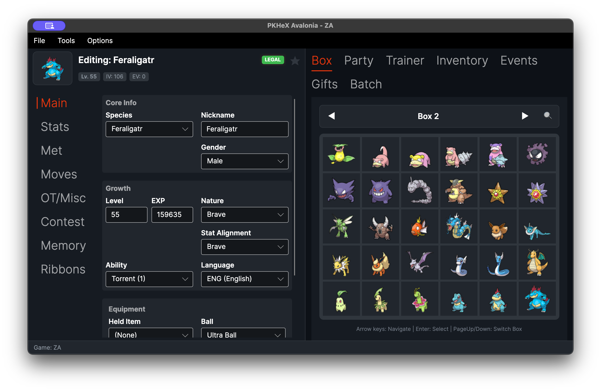
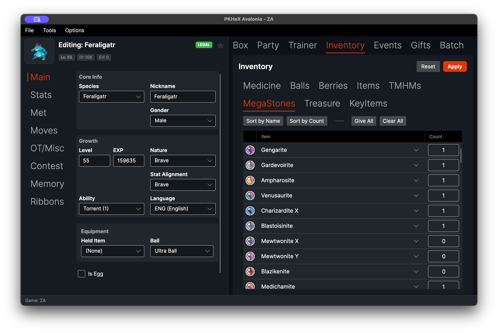
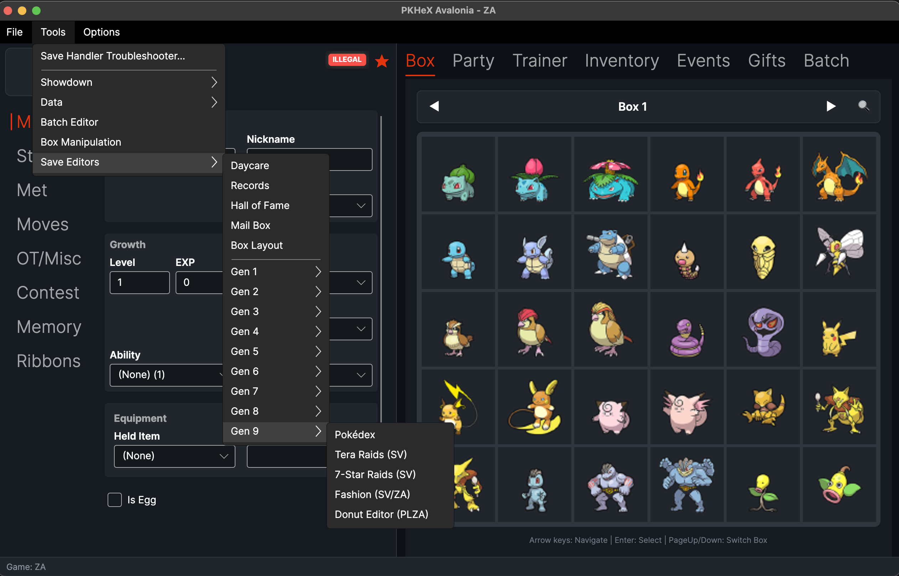

# PKHeX Avalonia


PKHeX Avalonia is the cross-platform [PKHeX](https://github.com/kwsch/PKHeX) port built with the Avalonia UI framework, bringing the classic Pokémon save editor to **Windows**, **macOS**, and **Linux** with a native look and feel.


## Download

Grab the latest release for your platform from the [Releases](https://github.com/realgarit/PKHeX-Avalonia/releases/latest) page:

| Platform | File |
|----------|------|
| Windows (x64) | `PKHeX-Avalonia-win-x64.zip` |
| Linux (x64) | `PKHeX-Avalonia-linux-x64.zip` |
| macOS Apple Silicon | `PKHeX-Avalonia-osx-arm64.zip` |
| macOS Intel | `PKHeX-Avalonia-osx-x64.zip` |

All releases are self-contained — no .NET runtime installation required.

**macOS Note:** The app is ad-hoc signed but not notarized, so on first launch macOS will warn "unidentified developer". To open it:
1. Right-click the app → select **Open** → click **Open** in the dialog
2. Or in Terminal: `xattr -d com.apple.quarantine ~/Downloads/PKHeX.Avalonia.app`


## Project Structure

The solution follows a clean, layered architecture so the cross-platform UI stays decoupled from the upstream logic:

| Project | Role | References |
|---------|------|------------|
| **PKHeX.Core** | Shared save/entity/legality logic, kept 1:1 with [upstream PKHeX](https://github.com/kwsch/PKHeX). Never modified directly. | — |
| **PKHeX.Application** | Application layer — use-cases and service abstractions over Core. | Core |
| **PKHeX.Infrastructure** | Platform & I/O implementations (file access, persistence, OS integration). | Application, Core |
| **PKHeX.Presentation** | MVVM view-models and presentation logic, UI-framework agnostic. | Application, Core |
| **PKHeX.Avalonia** | The Avalonia UI — views, styles, and the cross-platform desktop app. | all of the above |

Tests live under `Tests/` (`PKHeX.Core.Tests`, `PKHeX.Avalonia.Tests`, and `PKHeX.Architecture.Tests`, which enforces the layer boundaries above).

## Features

* Edit saves from Gen 1 to Gen 9, plus Let's Go, Legends: Arceus, BDSP, and Legends: Z-A.
* Edit any Pokémon: stats, moves, ribbons, memories, and more.
* Checks legality as you go and can fix illegal Pokémon for you.
* Import and export Pokémon files and Showdown sets.
* Move Pokémon between generations. It converts the format for you.
* Search your boxes with the PKM, Mystery Gift, and Encounter databases.
* Edit many Pokémon at once with the batch editor.
* Game specific editors under Tools, like Pokédex, Hall of Fame, and Secret Base.


## Building from Source

### Requirements
* [.NET 10 SDK](https://dotnet.microsoft.com/download/dotnet/10.0)

### Run
```bash
dotnet run --project PKHeX.Avalonia
```

### Build
```bash
dotnet build PKHeX.sln -c Release
```

### Test
```bash
dotnet test PKHeX.sln
```

### Publish (example: macOS ARM)
```bash
dotnet publish PKHeX.Avalonia -c Release -r osx-arm64 --self-contained -p:PublishSingleFile=true
```

## Screenshots

**Pokémon editor & box view** — full entity editor alongside the sprite-based box grid.


**Inventory editor** — per-pouch item editing (Medicine, Balls, Berries, Mega Stones, …).


**PKM Database** — searchable browser with the resizable / collapsible filter rail.


**Per-generation save editors** — Gen 1–9 plus game-specific tools under Tools → Save Editors.


## Credits
This fork is built on the incredible work of the [PKHeX team](https://github.com/kwsch/PKHeX).

* **Logic & Research:** [PKHeX](https://github.com/kwsch/PKHeX)
* **QR Codes:** [QRCoder](https://github.com/codebude/QRCoder) (MIT)
* **Sprites:** [pokesprite](https://github.com/msikma/pokesprite) (MIT)
* **Arceus Sprites:** National Pokédex - Icon Dex project and contributors.
