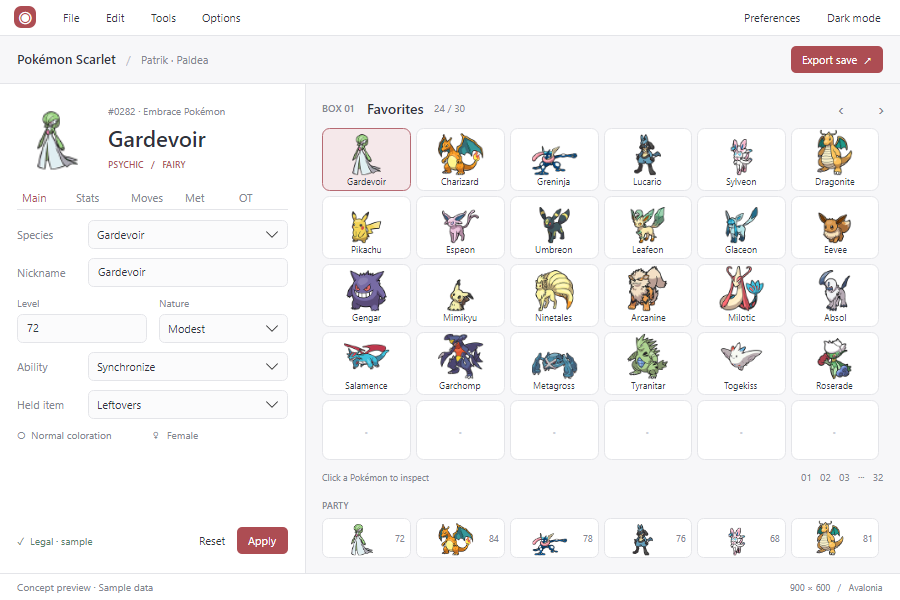
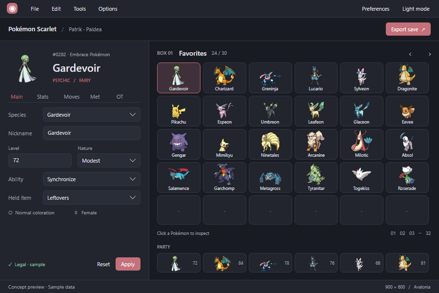
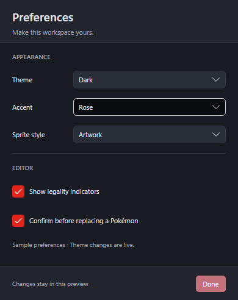

# Compact PKHeX UI: implementation handoff

Status: **production implementation available locally for user review; goal paused**. See [current review checkpoint](REVIEW.md).
Prepared 2026-09-18 against `74177bbbc48930ad5baee692cc87a460a44674d9`.
The user explicitly requested this checked-in plan and runnable starting point, then authorized implementation. This directory is a narrow exception to the root AGENTS.md ban on planning documents. The initial parallel implementation was followed by a personally integrated visual pass to match the prototype. The user has now paused the goal pending review; do not restart implementation or shipping from this historical dispatch plan without renewed direction.

## Start here

1. Read root `AGENTS.md`, [design specification](DESIGN.md), and [shared contracts](CONTRACTS.md).
2. Open all four [approved screenshots](reference/). The compact light and dark screenshots, not any earlier large Atelier design, are the visual target.
3. Optionally run the [reference prototype](reference-prototype/README.md). It is an isolated visual aid, outside `PKHeX.sln`.
4. Appoint one integrator and use [dispatch and merge instructions](DISPATCH.md).
5. Give each agent its own prompt from [agents/](agents/). Do not give all agents the whole redesign as an implementation assignment.
6. Require the [verification matrix](VERIFICATION.md) before calling the redesign complete.

## What was approved

A compact native desktop editor with a 900 × 600 logical-pixel client area: Pokémon editor on the left, storage on the right, a six-member party strip beneath storage, restrained rose accent, soft light surfaces, charcoal dark surfaces, real dropdowns, and a matching small settings window. No large workspace rail, dashboard, hero banner, marketing copy, or artificial empty space.

The images establish visual hierarchy and proportions. They do NOT authorize removing production controls, substituting sample data, inventing save semantics, or copying prototype architecture. Accessibility corrections to tiny text and low-contrast colors are explicitly required.

## Deliverables and concurrency

| Lane | Responsibility | Start condition |
|---|---|---|
| A | Theme/control/density foundation and common tokens | First |
| B | Compact shell, workspace navigation, top-level theme picker | A integrated |
| C | Pokémon editor composition and tab access | A integrated |
| D | Box/party components and interaction preservation | A integrated |
| E | Settings and secondary-window sizing | A integrated |
| F | Integration, localized strings, final runtime verification and shipping | Coordinates throughout; final changes after B–E |

B, C, D, and E can run concurrently in separate worktrees. Their merge order is D → C → E → B, followed by F. B may build against the component contract while D is in progress; B must not recreate D's component. A must land before these lanes touch shared styles. Each lane must leave a passing intermediate state. If a lane cannot do that, hold its PR for the integrator rather than merging broken dependencies.

## Explicit non-goals

- No Core/AutoMod sync, gameplay changes, legality rewrite, framework upgrade, new accent-picker feature, fake settings, or remote artwork dependency.
- No wholesale rewrite of every generation-specific dialog. Shared controls must improve them without breaking them; representative dialogs are tested in F. Any broader migration is a separately scoped follow-up.
- No removal of Save/Reports workspaces, capability registry, expert menu commands, keyboard navigation, or detached tools merely because they are absent from the mockup.
- No release from this documentation task. Implementation agents use normal branch/PR/CI procedures when the user launches them.

## Evidence boundaries

The reference program was built and its rendered light/dark layouts reviewed. It uses sample values, placeholder save buttons, simplified tabs and no real save services. Its captures are client-area renders from a running Avalonia window, not screenshots proving native popup, DPI, or OS title-bar behavior. Production visual and native interaction checks remain required.
