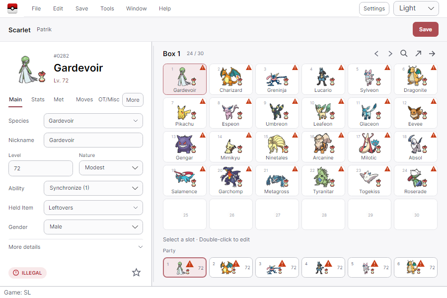
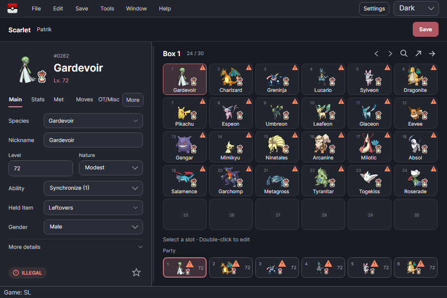

# Compact UI review checkpoint — 2026-09-18

The implementation branch is `codex/compact-ui-implementation`. The user reviewed a local checkpoint, then resumed the goal to complete validation and integration. The pull request and release history are authoritative for live shipping status.

## Result

- A genuine 900×600 composition replaces the old branded header and workspace rail.
- The editor's common fields align in full-width rows; extra fields are under More details. Advanced editor sections remain under More and their original commands remain available.
- Stats retains IV/EV totals. Current moves use aligned Move/PP/PP-Up columns; short dates have aligned input rows.
- Legal and illegal status use compact icon-and-text pills linked to the actual report. Empty entities and HaX do not receive an affirmative Legal indication.
- Box/party selection survives refresh; empty slots no longer render shiny markers. Party supports horizontal keyboard navigation and is hidden for unsupported saves. Double-clicking Box/Party headings opens the exact live detached workspace.
- Settings is a compact scrollable surface with an accessible persistent Save action. Theme/density persistence and the existing settings semantics are retained.
- Theme labels and the new hints/details label cover all nine language resources. Long field labels wrap; primary section navigation stays inside the editor in German/Japanese.

## Validation

The table records the first complete local checkpoint. The final pre-merge gate also includes the language-refresh regression tests described below; consult CI for that revision's exact totals.

| Gate | Result |
|---|---|
| Release solution build | 0 warnings, 0 errors |
| Avalonia full test suite | 2,673 passed; 1 existing native-window-lifetime skip |
| Core full test suite | 449 passed; 1 existing generator skip |
| Architecture tests | 6 passed |
| Architecture review | No layering violations; Core/AutoMod/UIVersion unchanged |
| MVVM review | Findings resolved: navigation in the ViewModel, truthful HaX status, horizontal party keys, restored totals |
| Production renders | Light/Dark main, Stats/Met/Moves/OT, dropdown, Settings, legal fixture, German/Japanese inspected |

Follow-up regression coverage changes UI language to German and Japanese with a populated Pokémon. It checks that native dropdown selections remain visible and the prepared Pokémon bytes remain identical. Native palette tests explicitly choose their theme to avoid dependence on the previously executed test's appearance.




The actual production composition is instantiated for the render tests, with temporary settings and synthetic Pokémon for the populated reference scene. Synthetic entities correctly show invalid reports. The separate Kingambit scene uses a real legal Core fixture and verifies legality before rendering. No labels are forced to Legal for screenshots.

The full image set is in `tmp/compact-ui-captures/`; the independently published executable is `tmp/compact-review/PKHeX.Avalonia.exe`. Those generated files are outside git; two representative reviewed frames are retained in `evidence/`. Recreate images from repository root:

```powershell
$env:PKHEX_HEADLESS_CAPTURE='1'
$env:PKHEX_HEADLESS_CAPTURE_DIR=Join-Path (Get-Location) 'tmp/compact-ui-captures'
dotnet test Tests/PKHeX.Avalonia.Tests/PKHeX.Avalonia.Tests.csproj -c Release --filter FullyQualifiedName~CompactUiCaptureTests
Remove-Item Env:PKHEX_HEADLESS_CAPTURE
Remove-Item Env:PKHEX_HEADLESS_CAPTURE_DIR
```

These are Skia-rendered production frames, not native OS screenshots. This pass used image inspection and routed/headless interaction tests as requested; native OS/DPI and macOS/Linux visual checks were not repeated. The original approved screenshots remain untouched in `reference/`.

## Separate follow-up

An unchanged backup-retention implementation has a same-millisecond filename reuse defect. One earlier full run exposed it; the final complete run passed. It was investigated read-only and recorded in root Working notes. A dedicated fix needs monotonic collision allocation, numeric suffix ordering, and deterministic timestamp coverage. It is not a reason to weaken or skip the backup test.
